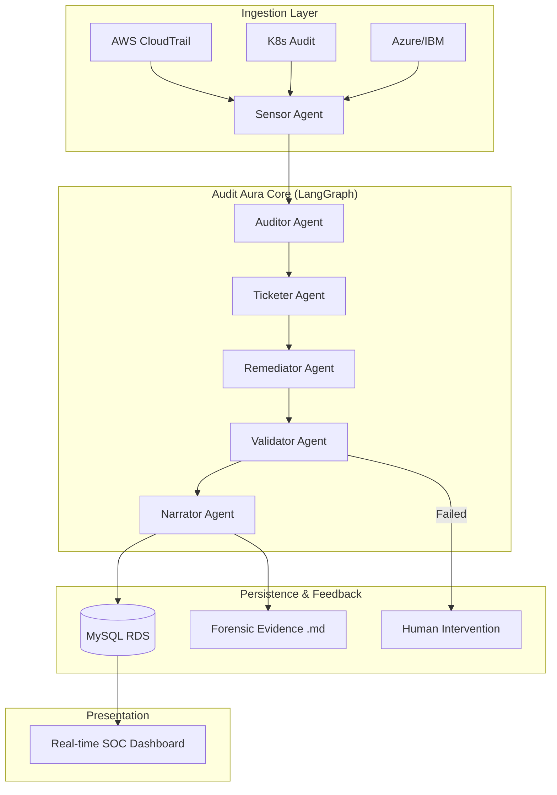

# Audit Aura: Continuous Compliance Observer

**Audit Aura** is an enterprise-grade agentic AI framework designed to transition organizations from point-in-time manual audits to **continuous, automated compliance auditing**. Developed for Semicolons 2026, it leverages LangGraph and Google Gemini 3.1 to monitor multi-platform cloud logs (AWS, K8s, IBM, Azure) and automate the detection-to-remediation lifecycle.

---

## 📽️ Submission Assets
- **Demo Video**: [demo_video.mp4](./demo_video.mp4) (5-10 minute walkthrough)
- **Presentation**: [presentation.pptx](./presentation.pptx) (Semicolons Pitch Deck)
- **Documentation**: [README.md](./README.md)

---

## 🎯 Solution Pitch (N-A-B-D)

### 1. The Need
Traditional compliance audits are **reactive, expensive, and incomplete**. Organizations often wait months for a SOC2/HIPAA audit, only to discover misconfigurations that existed for weeks. 
*   **The Gap**: 90% of security breaches occur between audit cycles.
*   **The Cost**: Manual remediation takes an average of **12 hours** per violation.

### 2. Our Approach
Audit Aura uses a **Stateful Multi-Agent Workflow** (LangGraph) to provide "Living Audits."
*   **Agentic Reasoning**: Unlike static rules, our agents reason over raw platform logs to understand *intent* and *context*.
*   **Autonomous Closure**: Low-to-medium risk violations are fixed automatically.
*   **Forensic Evidence**: Every incident generates a signed Markdown report with full technical proof.

### 3. Benefits (Quantified)
*   **🚀 99% Faster Detection**: Time-to-detect reduced from weeks to **seconds**.
*   **💰 70% Operational Savings**: Autonomous remediation eliminates manual tickets for routine drifts.
*   **📉 Zero Window of Risk**: Immediate auto-fixes for critical misconfigurations like Public S3 Buckets.

### 4. Differentiation
*   **Platform Agnostic**: Native support for AWS CloudTrail, K8s Audit, Azure ARM, and IBM Activity Tracker.
*   **Human-in-the-Loop**: Strict circuit-breakers for critical changes, ensuring safety alongside speed.
*   **Forensic Grade**: Generates durable evidence artifacts required by real-world SOC2 auditors.

---

## 🛠️ Architecture View



---

## 🚀 Deployment & Evaluation

### Semicolons Portal Deployment
The application is pre-configured for the **Semicolons Shared DNS Model**.
*   **Port**: `8000` (Mandatory)
*   **Protocol**: HTTP/SSE
*   **App Parameter**: The `?app=<APP_ID>` query parameter is automatically preserved across all frontend routes and API calls.

### Technical Setup
1.  **Model**: Uses **Gemini 3.1 Flash Lite** for high-performance reasoning.
2.  **Database**: Automatically utilizes the centrally provided RDS via environment variables.
3.  **Persistence**: Incident history is stored in MySQL; evidence files are persisted in `data/evidence/`.

### Local Quickstart
```bash
# 1. Setup
python -m venv .venv && source .venv/bin/activate
pip install -r requirements.txt

# 2. Initialize
python -m src.setup_data

# 3. Run
uvicorn src.api:app --host 0.0.0.0 --port 8000
```

---
*Developed by Team imdurgadas for Semicolons 2026*
